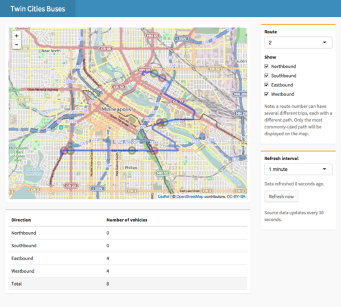

```{r echo = FALSE, message=FALSE}
library(shiny)
library(shinydashboard)
library(webshot)

knitr::opts_chunk$set(collapse = TRUE, comment = "##")

# Print HTML tags as HTML text
knit_print.shiny.tag <- function(x, ...) {
  as.character(x)
}
```


## Examples in this site

All of the screenshots in this site are taken from demo apps. Source code for these apps is available [here](https://github.com/rstudio/shinydashboard/tree/gh-pages/_apps).


## Twin Cities Buses

This app displays live locations of buses in the Minneapolis--Saint Paul Metro Transit system. The app fetches data from a [live feed](http://svc.metrotransit.org/).

[Source code](https://github.com/rstudio/shinydashboard/tree/gh-pages/_apps/buses/)

```{r eval=FALSE, echo=FALSE}
appshot('_apps/buses/', 'images/buses.png',
  delay=3
) %>%
  resize('50%') %>%
  shrink()
```

[](https://winston.shinyapps.io/buses/)

