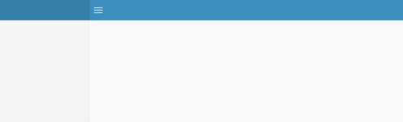
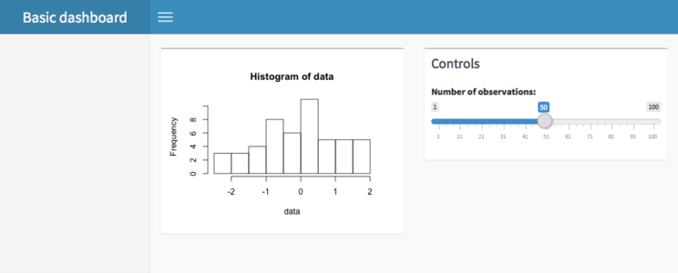
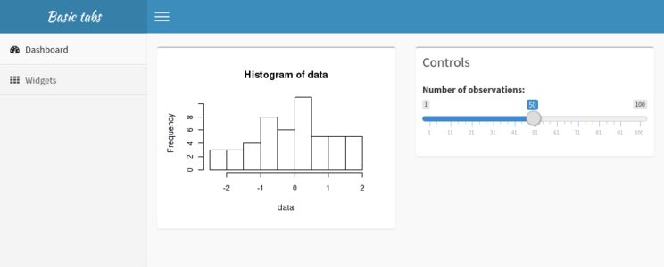
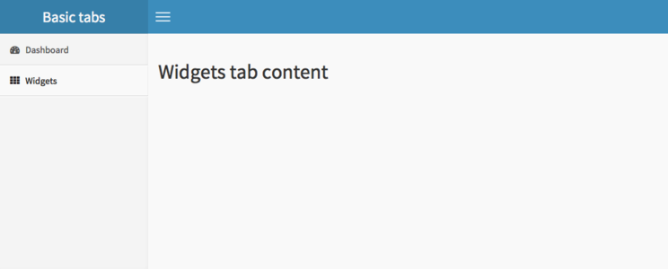

```{r echo = FALSE, message=FALSE}
library(shiny)
library(shinydashboard)
library(webshot)

knitr::opts_chunk$set(collapse = TRUE, comment = "##")

# Print HTML tags as HTML text
knit_print.shiny.tag <- function(x, ...) {
  as.character(x)
}
```


## Installation

**shinydashboard** requires Shiny 0.11 or above. To install, run:

```{r eval=FALSE}
install.packages("shinydashboard")
```

## Basics

A dashboard has three parts: a header, a sidebar, and a body. Here's the most minimal possible UI for a dashboard page.

```{r eval=FALSE}
## ui.R ##
library(shinydashboard)

dashboardPage(
  dashboardHeader(),
  dashboardSidebar(),
  dashboardBody()
)
```


You can quickly view it at the R console by using the `shinyApp()` function. (You can also use this code as a [single-file app](http://shiny.rstudio.com/articles/single-file.html)).

```{r eval=FALSE}
## app.R ##
library(shiny)
library(shinydashboard)

ui <- dashboardPage(
  dashboardHeader(),
  dashboardSidebar(),
  dashboardBody()
)

server <- function(input, output) { }

shinyApp(ui, server)
```

```{r eval=FALSE, echo=FALSE}
appshot('_apps/blank_dashboard/', 'images/blank_dashboard.png',
  delay=1, vheight=300
) %>%
  resize('50%') %>%
  shrink()
```



Obviously, this dashboard isn't very useful. We'll need to add components that actually do something. In the body we can add boxes that have content.

```{r eval=FALSE}
## app.R ##
library(shinydashboard)

ui <- dashboardPage(
  dashboardHeader(title = "Basic dashboard"),
  dashboardSidebar(),
  dashboardBody(
    # Boxes need to be put in a row (or column)
    fluidRow(
      box(plotOutput("plot1", height = 250)),

      box(
        title = "Controls",
        sliderInput("slider", "Number of observations:", 1, 100, 50)
      )
    )
  )
)

server <- function(input, output) {
  set.seed(122)
  histdata <- rnorm(500)

  output$plot1 <- renderPlot({
    data <- histdata[seq_len(input$slider)]
    hist(data)
  })
}

shinyApp(ui, server)
```

```{r eval=FALSE, echo=FALSE}
appshot('_apps/basic/', 'images/basic.png',
  delay=1, vheight=400
) %>%
  resize('75%') %>%
  shrink()
```




Next, we can add content to the sidebar. For this example we'll add menu items that behave like tabs. These function similarly to Shiny's `tabPanel`s: when you click on one menu item, it shows a different set of content in the main body.

There are two parts that need to be done. First, you need to add `menuItem`s to the sidebar, with appropriate `tabName`s.

```{r eval=FALSE}
## Sidebar content
  dashboardSidebar(
    sidebarMenu(
      menuItem("Dashboard", tabName = "dashboard", icon = icon("dashboard")),
      menuItem("Widgets", tabName = "widgets", icon = icon("th"))
    )
  )
```

In the body, add `tabItem`s with corrsponding values for `tabName`:

```{r eval=FALSE}
## Body content
  dashboardBody(
    tabItems(
      # First tab content
      tabItem(tabName = "dashboard",
        fluidRow(
          box(plotOutput("plot1", height = 250)),

          box(
            title = "Controls",
            sliderInput("slider", "Number of observations:", 1, 100, 50)
          )
        )
      ),

      # Second tab content
      tabItem(tabName = "widgets",
        h2("Widgets tab content")
      )
    )
  )
```

```{r eval=FALSE, echo=FALSE}
appshot('_apps/basic-tabs/', 'images/basic-tabs-1.png',
  delay=1, vheight=400
) %>%
  resize('75%') %>%
  shrink()

appshot('_apps/basic-tabs/', 'images/basic-tabs-2.png',
  delay=0.5, vheight=400,
  eval = "casper.then(function() {
    this.click('ul.sidebar-menu > li > a[href=\"#shiny-tab-widgets\"]');
    this.wait(500);
  });"
) %>%
  resize('75%') %>%
  shrink()
```

The default display, also shown when the "Dashboard" menu item is clicked:



And the display when "Widgets" is clicked:



That covers the very basics of using **shinydashboard**.

<div class="text-center">
**Next**: learn about the structure of a dashboard.

<a class="btn btn-success btn-lg" href="structure.html" role="button">Continue
<span class="glyphicon glyphicon-arrow-right"></span>
</a>
</div>
